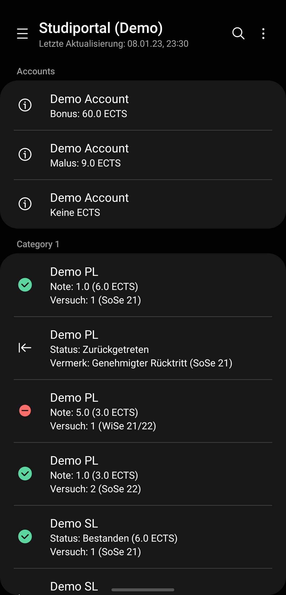
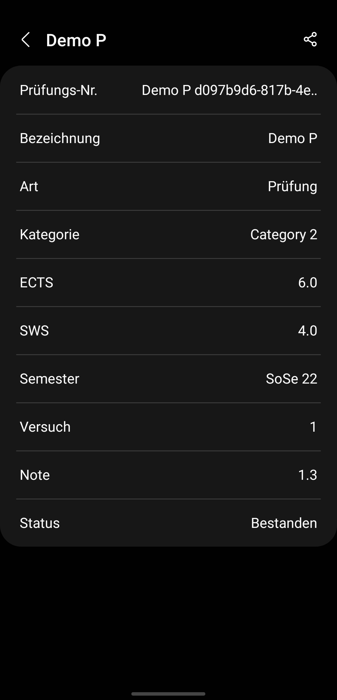
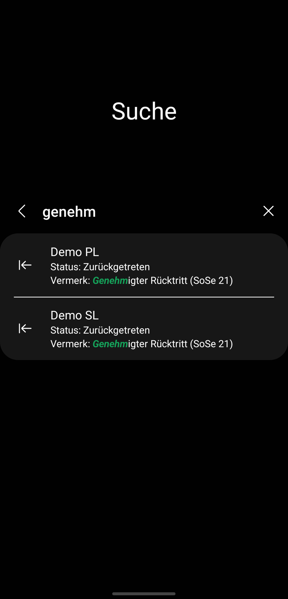

# Studiportal

The new Studiportal app with OneUI-Design

  
  
  
  

## More Information: <a target="_blank" href='https://www.leonard-lemke.com/apps/studiportal'> leonard-lemke.com </a>

     

### Stargazers over time

